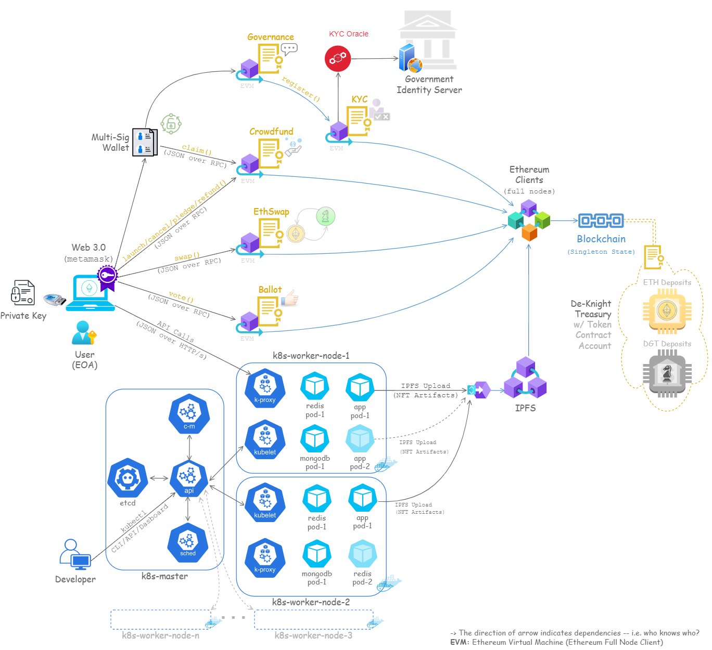

# ♞ De-Knight

`De-Knight` is a `play-to-earn` game that makes extensive use of blockchain technology, including cryptocurrencies, non-fungible tokens, crowdfunding, escrow, multi-sig wallets, governance, voting, decentralized KYC, Oracles and DAO. The players can earn money by selling freely earned in-game NFTs as well as by collecting cryptocurrencies and NFTs created in the blockchain.

---

# 📅 Roadmap

## 🏳️ Solo Game

## 🏳️ Multiplayer Game

### 🏴 Scan-to-Play ✔️

### 🏴 Text Chat ✔️

## 🏳️ Tournament

### 🏴 Scan-to-Play ✔️

### 🏴 Member Chat ✔️

### 🏴 Video Chat

### 🏴 Rating

## 🏳️ Token Swaps

### 🏴 ♦ ⇄ ♞

- ETH ♦ → DGT ♞ ✔️
- DGT ♞ → ETH ♦ ✔️

## 🏳️ NFT & Collectibles

### 🏴 Minting NFT ✔️

### 🏴 IPFS Storage ✔️

## 🏳️ Marketplace

### 🏴 Buy/Sell NFT

### 🏴 Buy/Sell DGT Coins

## 🏳️ Crowdfunding

### 🏴 Propose Campaign

### 🏴 Vote Campaign

### 🏴 Launch Campaign ✔️

### 🏴 Cancel Campaign ✔️

### 🏴 Pledge Funds ✔️

### 🏴 Unpledge Funds ✔️

### 🏴 Claim Funds ✔️

- Joint Approval w/ Multi-Sig Wallet

### 🏴 Refund ✔️

### 🏴 Crowdfunding UI Workflow

## 🏳️ Governance

### 🏴 ICO

### 🏴 Voting

## 🏳️ De-KYC

### 🏴 Oracle Integration

---

# 🏁 De-Knight Governance Token (DGT, ♞)

DGT enables its owners to make decisions in a decentralized manner.

- It is used to form DAO which is a governing body for the project.
- It facilitates decentralized communication between DGT holders.

### ☝️ **Why is this important?**

In today's centralized organizations decision making is bestowed upon a single leader or a small group of board members. Only they have the power to establish guidelines, set rules and determine the organization's future course. This leaves individuals, users, investors to be struck off from the whole conversation regarding its governance.

In the De-Knight's democratic governance model any individual who obtains DGT (♞) tokens may participate in a decentralized communication with other DGT token holders, put forward proposals on new rules or future direction of the De-Knight project, vote for proposals put forth by others in the De-Knight community.

# 🏁 De-Knight Governance Model

De-Knight has a blockchain-based automated voting and consensus mechanism that manages the administrative aspects of governance.

## 🏳️ The Logistics

To manage the logistics of governance and implementing changes within it, the De-Knight contract allows to mint & sell an initial supply of DGT coins (♞).

## 🏳️ The Decentralized Autonomous Organization (DAO)

DAO is essentially a governing body formed by the community and for by the community to drive De-Knight project goals. Individuals or groups who choose to purchase initially minted tokens are at the core of this governance.

De-Knight DAO is run by a portfolio of smart contracts that allows DGT holders to coordinate online, make decisions autonomously without ever knowing each other and establish rules that are encoded in the blockchain.

### ☝️ **What decisions could De-Knight DAO make?** _- you may ask._

DAO through a portfolio of smart contracts controls how money moves within blockchain and how the money in the treasury gets spent. It therefore allows you to:

- Act on proposals or RFC/RFEs for upgrades in game mechanics.
- Decide whether to invest gains from NFT trades in marketing of chess tournament.
- Decide whether you want to hire somebody for offline tasks such as booking venue, inviting VIPs/guests.
- Decide whether you want to fire somebody for doing a bad job.

### ☝️ **How much power does DGT holders actually possess?**

The DGT holders vote on how the money in the treasury gets spent.

Usually 1 DGT indicates 1 Vote but this gives unfair advantage to those who hold more tokens. Rather than favoring the number of tokens held, the De-Knight smart contracts favor the time a certain wallet has held their governance tokens for. It incentivizes early adopters who believed in the project and have been along for decision making processes for the longest.

# 🏁 De-Knight Treasury

The treasury is made up of the proceeds from the ICO. Any initiatives that receive support from the majority of token holders can be funded by the Treasury. In other words, the treasury allows for the funding for any proposals reaching a majority consensus amongst the token holders. These treasuries can later grow in value even further through liquid treasury and events such as staking, transaction fees.

# 🏁 De-Knight Crowdfunding

De-Knight supports crowdfunding through `peer-to-peer` fund raising model that removes the need for intermediaries. The game's `DGT (♞)` coins are exchangeable over peer to peer network.

This blockchain-based fundraising system provides an option for tournament organisers who plan to commit time, money, and resources to either renting a location for the match or spending money on marketing. With this crowdfunding feature the organisers can assess market acceptance & viability even before committing the accumulated funds. This knowledge makes tournament organizers even more willing to take on the financial risk of scheduling potentially lucrative matches.

### ☝️ **So how does De-Knight crowdfunding work?**

When a tournament organizer proposes a chess tournament, interested parties like investor, sponsors, and donors may support this event by pledging funds or by buying NFTs.

Each supporter transfers a certain amount of `DGT (♞)` tokens to the Crowdfund contract. Crowdfund contract acts like an escrow account. When the total amount in this escrow account reaches the desired amount within a stipulated time frame, the organizer may claim the entire fund to start preparing for the envisaged chess tournament.

### 🏳️ The 2 scenarios

1. Once the campaign for the proposed tournament is successful and authorised by the designated DAO members via voting, the organisers are given full/partial funding.

2. A portion of the funds is released to speed up project progress once each milestone (such as booking a chess venue or finishing a marketing campaign) is achieved and approved by a specific percentage of backers.

### 🏳️ The De-Knight Crowdfunding Contract

Crowdfunding is a program that defines and enforces all the terms & conditions under which the collected funds are to be released to the tournament organizers. This contract allows investors, sponsors, or donors to choose a campaign that they wish to invest/donate in. The Crowdfund contract enables a transparent relationship where organizers and investors/sponsors/donors are protected. Donors/sponsors can safely contribute to their favorite chess tournaments. The audience may also buy NFTs to support the tournament.

### 🏳️ De-Knight Tournament Campaign Workflow

1. Event organizer proposes a chess tournament.
2. DGT holders vote for the proposal through De-Knight Governance contract.
3. Based on the voting result the De-Knight's designated/elected members, through its multi-sig wallets, approve the creation of a chess tournament campaign.
4. Event organizers execute Crowdfund::launch() w/ campaign's start date, end date and goal.
5. Investors/sponsors/donors execute Crowdfund::pledge()/unpledge() before campaign's end date.
6. If the campaign's goal is not met by the end date then the Crowdfund contract allows refund to be initiated by the investors/sponsors/donors.
7. If the campaign's goal is met by the end date then the organizers can initiate Crowdfund::claim() transaction.
8. Claims are approved through multi-sig wallet.

---
